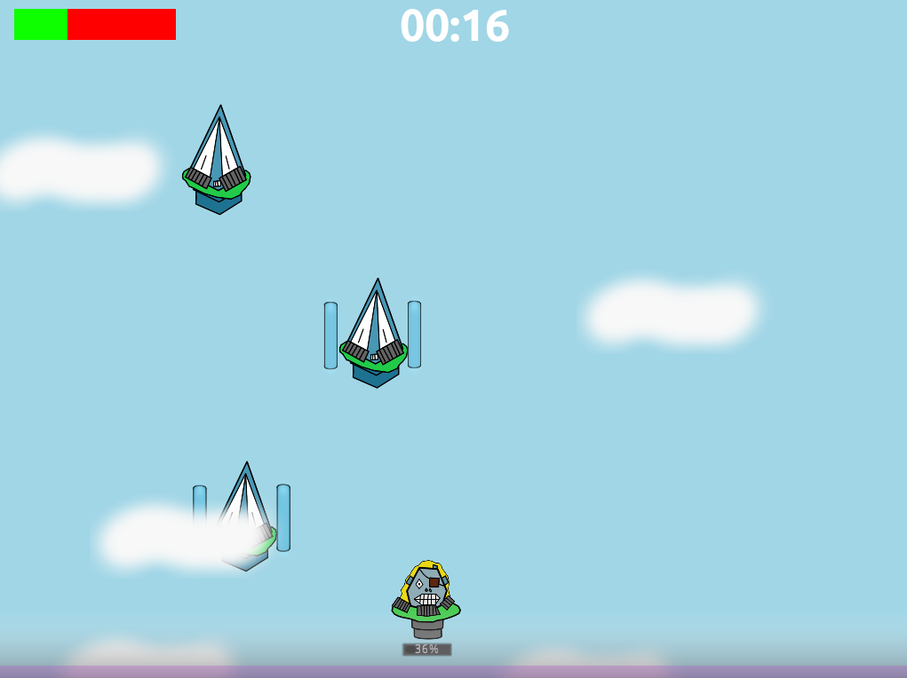
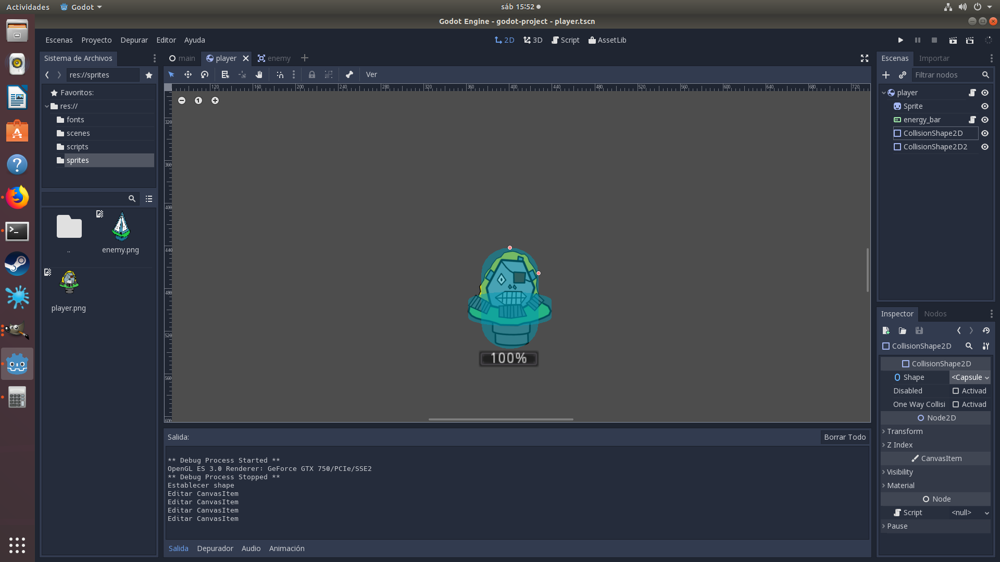
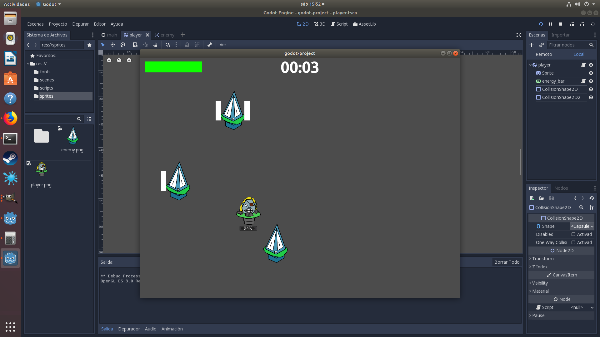
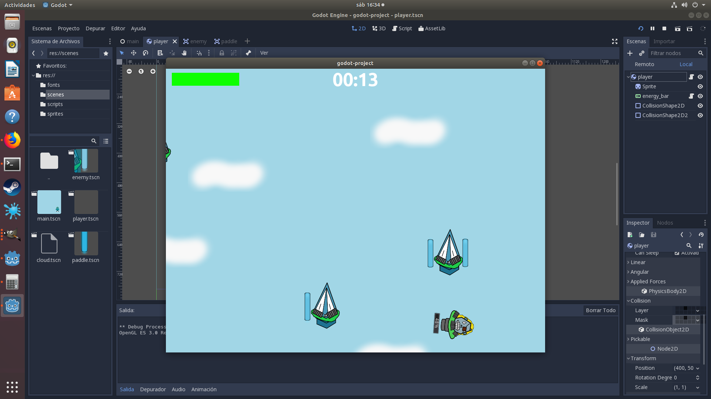

# Piratinsul'

An ability game developed for [Games Factory Jam 8](https://itch.io/jam/games-factory).

## About

The greatest island-robot-pirate Piratinsul' has just stolen a big mountain of gold!

Unfortunately, the police discovered him and now he is on the run. Help him!

## Mechanics

The player's character is flying far from police but the sky is full of another robotic islands. Avoid them as long as you can!

Be careful though, for moving around will cost you energy, so spare it!

## Controls

Left / Right arrow: move left / right

## Downloads

Downloads available at <https://moisesjbc.itch.io/piratinsul>

## Credits

### Idea, graphics and programming

Moisés J. Bonilla Caraballo (moisesjbc)

### Music and sounds

All sounds were downloaded from freesound.org and belong to their respective authors

* Music: "Faster version of alphatone's Freesound #385876.flac" by Timbre
(https://freesound.org/people/Timbre/sounds/385882/)
* Collision with enemies: "Cans crash vers.2.mp3" by CGEffex (https://freesound.org/people/CGEffex/sounds/92347/)
* Batery recharge: "Powerup05.wav" by sharesynth
(https://freesound.org/people/sharesynth/sounds/344522/)
* Game over: "Game_over.wav" by deleted_user_877451
(https://freesound.org/people/deleted_user_877451/sounds/76376/)

### Software

* [Godot Engine](https://godotengine.org/)
* [Gimp](https://www.gimp.org/)
* [SimpleScan](https://gitlab.gnome.org/GNOME/simple-scan)
* [dir2ogg](https://github.com/julian-klode/dir2ogg)

### Font

Ubuntu-B.ttf (https://design.ubuntu.com/font/)

## Development images

### Adding collisions to player

### Adding sprites

### Crazy physics

